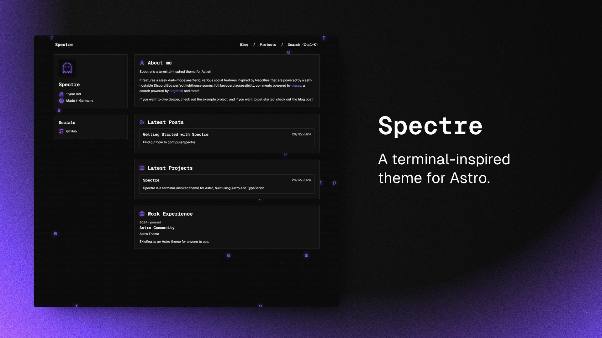

以 astro 為框架開發的個人部落格，使用 spectre 主題，並且部署在 netlify 上。

## Dev Note
- 2025-03-12: 

  - 開始使用 Astro 作為框架進行開發，並選定主題 spectre 。  
  - 解決中文字型不適配問題，並增加 footer。  
  - 部署到 netlify 遇到小麻煩，增加適配器與修改 pnpm-lock.yaml，成功部署。

- 2025-03-13:
  - 修改 about me, info, experience 等內容。
  - 增加了一些 blog post，並且更新了 README.md。
  - 將 table of content 功能放到 project，並使其適配中文。
  - 加入 astro-embed 套件以支援 youtube 嵌入。

## Thanks to
- [Astro](https://astro.build/)
- [Spectre](https://github.com/louisescher/spectre)